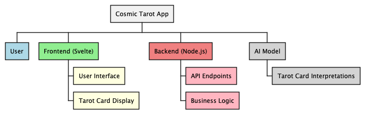
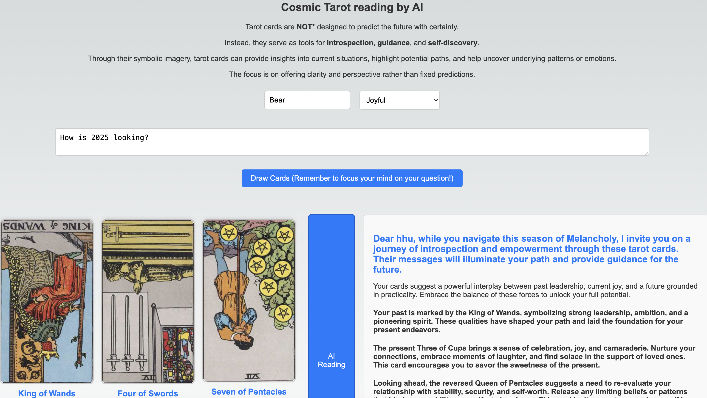

# Cosmic Tarot

Cosmic Tarot is a Svelte application that provides tarot card readings using AI. The ancient symbols on the cards are designed to stimulate intuition, connecting users with their higher selves or spiritual aspects.

## Overview

Cosmic Tarot aims to offer users a unique and personalized tarot reading experience. By leveraging AI, the application provides interpretations of tarot cards that are tailored to the user's input, enhancing self-awareness and creativity.

## Tech Stack

- **Frontend**: Svelte
- **Backend**: Node.js
- **Language**: TypeScript, JavaScript
- **Build Tool**: Vite
- **Package Manager**: npm

## Features

- Tarot card reading
- AI-generated interpretations
- User input for personalized readings
- GEMINI model: "gemini-pro" (Generalized Multimodal Intelligence)
- TODO: LLM (Large Language Model) with ollama ai

## Getting Started


### Prerequisites

- Node.js (v20 or higher)
- npm (v10 or higher)

### Installation

1. Clone the repository:

   ```bash
   git clone https://github.com/dhanugupta/cosmic-tarot.git
   cd cosmic-tarot
   ```

2. Install dependencies:

   ```bash
   npm install
   ```

### Development

To start the development server:

```bash
npm run dev
http://localhost:5173/
```
